```mermaid
flowchart TD
    A[Root] --> B1[src]
    B3[.github]
    B4[workflows]
    B5[api]
    B6[index.php]
    B7[app]
    B8[Http]
    B9[Models]
    B10[Providers]
    B11[bootstrap]
    B12[cache]
    B13[app.php]
    B14[providers.php]
    B15[config]
    B16[app.php]
    B17[auth.php]
    B18[cache.php]
    B19[database]
    B20[factories]
    B21[migrations]
    B22[seeders]
    B23[public]
    B24[build]
    B25[.htaccess]
    B26[favicon.ico]
    B27[resources]
    B28[css]
    B29[js]
    B30[views]
```

# 🚀 TesLaravel

**[EN]** The skeleton application for the Laravel framework.

**[ID]** The skeleton application for the Laravel framework.

---

[]()
[]()
[]()
[]()
[]()

---

## ✨ Features / Fitur

> **[EN]** Key features of this project.

> **[ID]** Fitur utama dari project ini.

- api module

---

## 🏗️ Architecture / Arsitektur

**[EN]** Project structure overview.

**[ID]** Ikhtisar struktur project.

``
.github/
  workflows/
api/
  index.php
app/
  Http/
  Models/
  Providers/
  Services/
bootstrap/
  cache/
  app.php
  providers.php
config/
  app.php
  auth.php
  cache.php
  database.php
  filesystems.php
database/
  factories/
  migrations/
  seeders/
  .gitignore
public/
  build/
  .htaccess
  favicon.ico
  index.php
  robots.txt
resources/
  css/
  js/
  views/
routes/
  console.php
  web.php
storage/
  app/
  framework/
  logs/
tests/
  Feature/
  Unit/
  TestCase.php
.editorconfig
.env
.gitattributes
.gitignore
.npmrc
.styleci.yml
AGENTS.md
artisan
CHANGELOG.md
``



---

## 🛠️ Tech Stack

| Component | Purpose |
|-----------|---------|
| PHP | Runtime |
| `php` | - |
| `guzzlehttp/guzzle` | - |
| `laravel/framework` | - |
| `laravel/tinker` | - |


---

## 🚀 Quick Start

### Prerequisites

* [](https://git-scm.com/)

* [](https://www.php.net/)

### Installation / Instalasi

```bash
# Clone
git clone https://github.com/GrayZeus20/Movieflix.git
cd TesLaravel

# Install dependencies / Install dependensi
composer install
```

### Development / Pengembangan

```bash
# Start dev server / Jalankan server development
php artisan serve
```

### Build

```bash
composer install --no-dev
```

### Testing / Pengujian

```bash
php artisan test
```

---

## ⚙️ Configuration / Konfigurasi

**[EN]**

Configure config.php or .env with your settings:

**[ID]**

Konfigurasikan config.php atau .env dengan pengaturan Anda:

```bash

# Edit config.php or .env file
```

---

## 📜 Available Commands / Perintah Tersedia

| Script | Command |
|--------|---------|
| `IsReadOnly` | `False` |
| `IsFixedSize` | `False` |
| `IsSynchronized` | `False` |
| `Keys` | `dev post-create-project-cmd pre-package-uninstall test setup post-root-package-install post-update-cmd post-autoload-dump` |
| `Values` | `System.Object[] System.Object[] System.Object[] System.Object[] System.Object[] System.Object[] System.Object[] System.Object[]` |
| `SyncRoot` | `System.Collections.Hashtable` |
| `Count` | `8` |


---

## 📚 Documentation / Dokumentasi

<!-- Add documentation links here -->

---

## 🕒 Recent Changes / Perubahan Terbaru

* Refactor code structure for improved readability and maintainability
* feat: enhance theme variables and add transition effects for smoother UI
* feat: add filter functionality and update layout for movie selection
* update
* fix: use secure_url for all form actions and API fetch to prevent mixed content
* fix: force https in production, update APP_URL
* docs: add AGENTS.md with Tailwind v4, Laravel, and deployment rules
* fix: use inline width on scroll items to ensure 140px card size on home

---

## 🛡️ Security / Keamanan

**[EN]**
* API keys and secrets are never committed to Git.
* All .env files are git-ignored.
* Only .env.example with placeholder values is tracked.

**[ID]**
* API key dan rahasia tidak pernah di-commit ke Git.
* Semua file .env di-gitignore.
* Hanya .env.example dengan nilai placeholder yang di-track.

---

## 🤝 Contributing / Kontribusi

1. Fork this repository
2. Create a feature branch (git checkout -b feature/amazing-feature)
3. Commit your changes (git commit -m 'Add amazing feature')
4. Push to the branch (git push origin feature/amazing-feature)
5. Open a Pull Request

---

## 👤 Author / Pengembang

Dandi January

---

## 📄 License / Lisensi

MIT © 2026
